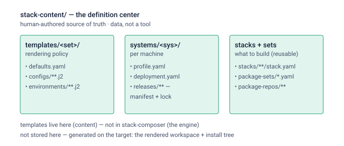

# stack-content

The human-authored **source of truth** that `stack-composer render` consumes —
the "stack directory" / definition center for the stack-generation project. It is
**data, not a tool**: the fourth repo alongside `cluster-inspector`,
`stack-composer`, and `stack-planning`.

It is synced onto each target's shared filesystem (or read GitLab-direct) where
`stack-composer render` and the chosen build path run. There may be more than one
stack-content repo (per team or per stack family); the pattern is the same.



For the full renderer's per-stack workspaces and shared install-tree lifecycle,
see `stack-planning/docs/stack_workspace_lifecycle_v1.md`. The current static
CSE pilot deliberately uses separate restricted and published install trees;
its canonical procedure is `stack-planning/docs/runbook.md`.

## Layout

```text
templates/<set>/                 # the reusable placeholder tree (the INPUT)
  defaults.yaml                  #   site policy merged into every stack
  configs/                       #   Spack component yamls as Jinja (.j2): common, os/, target/,
                                 #     vendor/, mpi/<provider>/, gpu/<toolkit>/
  environments/                  #   per-lane spack.yaml.j2 (core, serial, mpi, gpu)
package-sets/*.yaml              # curated Spack spec sets a stack can reference
package-repos/<name>/            # optional Spack package repositories
stacks/<stack>/stack.yaml        # package intent (spec-native: name + specs [+ kind])
systems/<system>/profile.yaml    # observed facts from cluster-inspector (tracked per system)
systems/<system>/deployment.yaml # installer-chosen roots and shared access policy
pilots/<pilot>/                  # temporary, named starter blueprints for a specific rollout
```

`deployment.yaml` is required for render. It owns install tree, build-stage,
cache, view-root, module-root, buildcache destination, Spack root, and shared
access choices for that system. Stack Composer maps `access` to Spack package
permissions; the build/publish path applies the same policy to non-package
artifacts.

## Two trees — what's authored vs what's generated

- **Authored (here):** `templates/<set>/` is the placeholder tree. It barely
  changes between systems; the `.j2` files carry `{{ placeholders }}` (OS,
  target, compiler prefixes, …).
- **Generated (by stack-composer, not committed here):** the rendered workspace
  — concrete `configs/` + `environments/<compiler>/<lane>/spack.yaml` that
  `include::`s them + `release-manifest.yaml`. That tree is the **handoff** to a
  build path (spacktools / spack-build / Ansible / bare Spack). See
  stack-planning `docs/stack_build_handoff_note_v1.md`.

`stack-composer` fills the placeholders from `profile ∩ deployment ∩ defaults ∩
stack`. The rendered `configs/` therefore differ per system even though the
template is shared.

## Three distinct consumption paths

- `render-static` produces the generic, reusable platform catalog from an
  observed profile. It contains compiler, MPI, GPU, common-external, and
  platform scopes plus an exact `profile.yaml` snapshot for review; it contains
  no CSE package roster or deployment workspace.
- `init-workspace` combines an exact static-catalog selection with an authored
  starter blueprint. `pilots/cse-pilot/` uses this seam to produce the current
  CPU-only Foundation/Core/Common/Serial/MPI trial environments, module policy,
  and a generated `cse-build` resume entry point for the receiving builder. The
  pilot blueprint applies its declared group access modes to the new workspace.
- `render` remains the full curated-stack path. It owns the complete automated
  workspace, deployment inputs, lanes, views, modules, and release manifest.

The CSE Initial Conversion Trials starter kit is intentionally named and
isolated. Its package roster can change without turning trial policy into
generic static-catalog behavior. See `pilots/cse-pilot/README.md` and copy
`pilots/cse-pilot/site-values.example.yaml` for each target system.

Use `stack-planning/docs/runbook.md` as the single procedure for Blueback,
Raider, Wheat, and Fran. It keeps the restricted source build separate from the
shared cache-only publication while preserving the same approved lockfiles.

## How render consumes this repo

```sh
stack-composer render \
  --profile      systems/<system>/profile.yaml \
  --deployment   systems/<system>/deployment.yaml \
  --stack        stacks/<stack>/stack.yaml \
  --templates    templates \
  --package-sets package-sets \
  --package-repos package-repos \
  --output-root  <render-dir> \
  --release      <release> \
  --rendered-at  <utc-timestamp> \
  --source-repo  <source-repo-url-or-id> \
  --source-commit <source-commit>
```

## Status

Pre-v1; no release deployed. The template set was lifted out of
`stack-composer/tests/fixtures` (stack-composer keeps minimal fixtures for its
own unit tests). If the shape is wrong, change it directly before v1.
